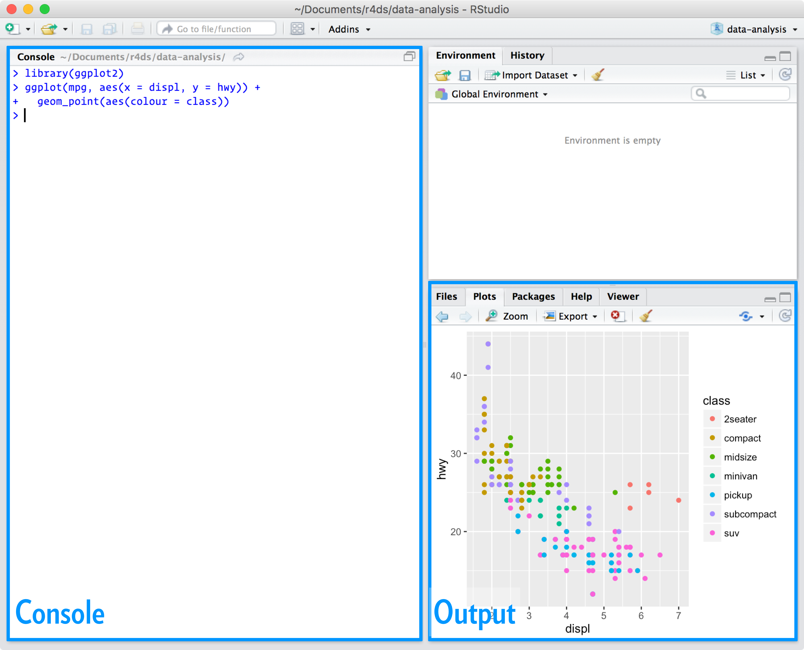

# 1 Introduction

> R for Data Science 学习链接 https://r4ds.had.co.nz/introduction.html

---

`Data Science`数据科学是一门令人兴奋的学科，您可以使用这门学科将原始数据转化为对数据的理解、洞察和知识。
`R for Data Science`的目标是帮助您在从事数据科学的过程中，学习`R`这门最重要的工具。
读完这本书后，您将使用`R`在数据科学中处理各种各样的数据。

---

## 1.1 What you will learn

`Data Science`数据科学是一个巨大的领域，您不可能通过阅读一本书就掌握它。本书的目标是为您在最重要的工具方面打下坚实的基础。我们在一个典型的数据科学项目中所需要的工具模型是这样的:


首先，您必须将您的数据导入`import`到`R`中。这通常意味着您将数据存储在文件、数据库或web应用程序编程接口(API)中，并将其加载到`R`中的数据框`dataframe`中。如果您不能将您的数据导入到`R`中，您就不能对它进行数据科学方面的研究!

导入数据后，最好对其进行整理`tidy`。整理数据意味着以一种与数据集的语义和存储方式相匹配且一致的方式来存储数据。简而言之，当数据整洁时，每一列是一个变量，每一行是一个观察结果。
整洁的数据非常重要，因为一致的结构可以让您将精力集中在关于数据的问题上，而将不必要的精力花费在调整数据格式上。

一旦有了整洁的数据`tidy data`，常见的第一步就是对其进行转换`transform`。
转换包括缩小感兴趣的观察范围(如一个城市中的所有人，或去年的所有数据)，
创建基于现有变量的新变量(如从距离和时间计算速度)，
以及计算一组汇总统计数据(如计数或平均值)。
整理`tidying`和转换`transfroming`一起被称为争吵`wrangling`，因为将数据以一种自然的方式处理通常感觉像吵架!

一旦您有了整洁的数据`tidy data`和您需要的变量`variables`，那么就有两个主要的词汇生成:可视化`visualisation`和建模`modelling`。
它们有互补的优势和劣势，所以任何真正的分析都将在它们之间进行多次迭代。

视觉化`Visualisation`是一种最基本的人类活动。一个好的可视化会显示您没有预料到的事情，或者提出关于数据的新问题。一个好的可视化也可能暗示您提出了错误的问题，或者您需要收集不同的数据。视觉效果可能会让您感到惊讶，但它的扩展性不是特别好，因为它需要人类来解释。

模型`Models`是可视化的补充工具。一旦您的问题足够精确，您就可以使用一个模型来回答它们。模型基本上是一种数学或计算工具，因此它们通常具有良好的可伸缩性。即使没有，买更多的电脑通常比买更多的大脑更便宜!但每个模型都会做出假设，而从本质上讲，一个模型无法质疑自己的假设。这意味着一个模型不能从根本上让您吃惊。

数据科学`Data Science`的最后一步是沟通`communication`，这是任何数据分析项目的绝对关键部分。无论您的模型和可视化如何引导您理解数据，除非您也能将您的结果传达给其他人。

围绕着这些工具的是编程`programming`。编程是一种横切工具，您可以在项目的每个部分使用它。成为一名数据科学家`data scientist`并不需要成为一名专业的程序员`programmer`，但是学习更多关于编程的知识是值得的，因为成为一名更好的程序员可以让您自动化常见的任务，并更轻松地解决新问题。

您将在每个数据科学项目中使用这些工具，但对于大多数项目来说，它们是不够的。这里有一个大致的80-20规则;使用本书中介绍的工具，您可以完成每个项目的80%，但您需要其他工具来完成剩下的20%。在本书中，我们将为您指出一些资源，您可以从中了解更多信息。

---

## 1.2 How this book is organised

前面对数据科学工具的描述大致按照您在分析中使用它们的顺序进行组织(当然，您将多次遍历它们)。然而，根据我们的经验，这并不是学习它们的最佳方式:

1.从`数据提取`和`数据清洗`开始学习数据科学是次优的，因为80%的时间是平淡乏味的和无聊的，其余20%的时间是奇怪和令人沮丧的。这不是开始学习一门新课程的好方法!相反，我们将从已经导入和整理的数据的可视化和转换开始。这样，当您消化和整理您自己的数据时，您的动力会保持很高，因为您知道前面进行数据提取和数据清洗的痛苦过程都是值得的。

2.有些主题最好用其他工具来解释。例如，我们相信，如果您已经了解了可视化、整洁的数据和编程，那么就更容易理解模型是如何工作的。

3.编程工具本身并不一定有趣，但确实允许您处理相当具有挑战性的问题。在本书的中间部分，我们会给您一些编程工具的选择，然后您会看到它们如何与数据科学工具相结合，以解决有趣的建模问题。

在每一章中，我们试图坚持一个相似的模式:从一些有趣的例子开始，这样您就可以看到更大的画面，然后深入细节。本书的每个部分都配有练习，帮助您练习所学的知识。虽然跳过练习很诱人，但是没有比在实际问题上练习更好的学习方法了。

---

## 1.3 What you won’t learn

这本书没有涉及到一些重要的话题。
我们相信，我们要把大部分的精力放在本书的关键部分，这样您就能尽快地站起来和跑起来。
因此，这也意味着这本书不能涵盖每一个重要的主题。

### 1.3.1 Big data

这本书主要专注于内存中的小型数据集。
这是一个正确的开始，因为除非您有处理小数据的经验，否则您根本无法处理大数据。
您在本书中学习的工具将轻松地处理数百兆字节的数据，并且您通常可以使用它们处理1-2 Gb的数据。
如果您经常使用较大的数据(比如10- 100gb)，那么您应该学习更多关于`data.table`的知识。
这本书并不提及`data.table`，但是如果您处理的是大数据，那么就去付出额外的努力去学习它。

如果您的数据量很大，请仔细考虑您的大数据问题是否实际上是一个伪装的小数据的问题。虽然完整的数据可能很大，但回答特定问题所需的数据通常很小。您可能能够找到适合内存的子集、子样本或摘要，并且仍然可以回答您感兴趣的问题。这里的挑战是找到正确的小数据，这一过程通常需要大量的迭代。

另一种可能性是，您的大数据问题实际上是大量小数据的问题。每个单独的问题可能适合内存，但您有数以百万计的问题。例如，您可能希望为数据集中的每个人拟合一个模型。如果您只有10或100个人，这是微不足道的工作量，但您有100万人，这个工作量就很庞大了。幸运的是，每个问题都是独立于其他问题的(这种设置有时被称为令人尴尬的并行)，所以您只需要一个系统(如`Hadoop`或`Spark`)，允许您将不同的数据集发送到不同的计算机进行处理。一旦您使用本书中描述的工具解决了单个子集的问题，您就可以学习新的工具，如`sparklyr`、`rhipe`和`ddr`来解决整个数据集的问题

### 1.3.2 Python, Julia and firends

在这本书中，您不会学到任何关于`Python`、`Julia`或任何其他对数据科学相关的编程语言的内容。这并不是因为我们认为这些工具不好。相反，在实践中，很多数据科学团队使用混合语言，通常至少是`R`和`Python`。
然而，我们坚信最好是一次掌握一种工具。如果您深入钻研，而不是把自己的精力分散在许多话题上，这样您会进步的更快。

我们认为`R`是开始您的数据科学之旅的好地方，因为它是一个从头开始设计来支持数据科学的环境。`R`不仅是一种编程语言，也是一种进行数据科学的交互式环境。
。

### 1.3.3 Non-rectangular data

本书专门关注矩形数据:值的集合，每个值都与一个变量`variable`和一个观察值`observation`相关联。有很多数据集并不适合这种模式，包括图像、声音、树文件`tree`和文本。但是矩形数据框在科学和工业中是非常常见的，我们相信它们是开始您的数据科学之旅的好地方。

### 1.3.4 Hypothesis confirmation

可以将数据分析`Data Analysis`分为两个阵营:假设生成`hypothesis generation`和假设确认`hypothesis confrimation`(有时称为验证性分析)。这本书的重点是假设生成，或数据探索。在这里，您将深入研究数据，并结合您的学科知识，生成许多有趣的假设，以帮助解释数据的行为方式。您非正式地评估假设，用您的怀疑态度以多种方式挑战数据。

假设生成的补充是假设确认`hypothesis confirmation`。假设的确认之所以困难，有两个原因:

1.您需要一个精确的数学模型来生成可证明真伪的预测。这通常需要相当复杂的统计。
2.您只能用一次观察来证实一个假设。一旦您不止一次使用它您就又回到了做探索性分析`exploratory analysis`。这意味着做假设确认，您需要“预先登记”(提前写出来)您的分析计划，即使您已经看到了数据，也不要偏离它。我们将讨论一些您可以在建模`modelliing`中使用的策略。

通常认为建模`modelling`是一种确认假设`hypothesis confirmation`的工具，而可视化`visualisation`则是生成假设`hypothesis generation`的工具。但这是一种错误的二分法:模型通常用于探索，只要稍微小心，您就可以使用可视化来进行确认。关键的区别在于您观察每个观察结果的频率:如果您只看一次，那就是确认;如果您不止看一次，那就是探索。

---

## 1.4 Prerequisites

为了从这本书中获得最大的效果，我们对您已经知道的东西做了一些假设。您应该对数字有一定的了解，如果您已经有一些编程经验，这是很有帮助的。如果您以前从未编写过程序，您可能会发现Garrett的` Hands on Programming with R `是这本书有用的补充。
运行本书中的代码需要四样东西:`R`、`RStudio`、R包`tidyverse`，以及一些其他`R`包。
`R`包是可复制的`R`代码的基本单元。它们包括可重复使用的函数、描述如何使用它们的文档和示例数据。

### 1.4.1 R 
下载`R`语言， 就去`CRAN(the comprehensive R archive notwork)` 。 `CRAN`由一组分布在世界各地的镜像服务器组成的，用于分发`R`和`R`包。
不一定要选择离您最近的镜像，而是使用`https://cloud.r-project.org`，云镜像，它会自动为您找出最合适的镜像。
`R`的新主要版本每年发布一次，每年有2-3个小版本。定期更新是个好主意。
对于主要版本来说，升级可能有点儿麻烦，因为需要重新安装所有的软件包，但推迟升级只会让后续的情况变得更加糟糕。

### 1.4.2 RStudio

`RStudio`是一个用于`R`编程的集成开发环境或`IDE`。从http://www.rstudio.com/download下载并安装。`RStudio`每年都会更新几次。当新版本可用时，`RStudio`会通知您。定期升级是个好主意，这样你就可以利用最新和最好的功能。对于这本书，请确保您至少有`RStudio 1.0.0`。

你启动`RStudio`时，你会在界面中看到两个关键区域:



现在，您所需要知道的就是在控制台窗口中写`R`代码，然后按回车键运行它。随着我们的学习，你会学到更多!

### 1.4.3 The tidyverse
您还需要安装一些`R`包。`R`包是函数、数据和文档的集合，它们扩展了`base R`的功能。
使用包是成功使用`R`的关键。`tidyverse`中的包共享数据和`R`编程的共同理念，并被设计成自然地一起工作。

你可以用一行代码安装完整的`tidyverse`:

```
install.packages("tidyverse")
```
在您自己的计算机上，在控制台中键入这行代码，然后按回车键运行它。`R`将从`CRAN`下载软件包并安装到您的计算机上。如果您在安装时遇到问题，请确保您已连接到互联网，并且https://cloud.r-project.org/没有被防火墙或代理屏蔽。

在使用`library()`加载包之前，您将无法使用包中的函数、对象和帮助文件。一旦你安装了一个包，你可以用`library()`函数来加载它:

```
library(tidyverse)
#> ── Attaching packages ─────────────────────────────────────── tidyverse 1.3.0 ──
#> ✔ ggplot2 3.3.2     ✔ purrr   0.3.4
#> ✔ tibble  3.0.3     ✔ dplyr   1.0.2
#> ✔ tidyr   1.1.2     ✔ stringr 1.4.0
#> ✔ readr   1.4.0     ✔ forcats 0.5.0
#> ── Conflicts ────────────────────────────────────────── tidyverse_conflicts() ──
#> ✖ dplyr::filter() masks stats::filter()
#> ✖ dplyr::lag()    masks stats::lag()
```
这说明`tidyverse`正在加载`ggplot2`、`tibble`、`tidyr`、`readr`、`purrr`和`dplyr`包。它们被认为是`tidyverse`的核心，因为您将在几乎所有的分析中使用它们。

在这个`tidyverse`中，包的变化相当频繁。您可以通过运行`tidyverse_update()`来查看更新是否可用，并可以选择安装它们。


### 1.4.4 Other packages
有许多其他优秀的包并不属于`tidyverse`，因为它们在不同的领域中解决问题，或者使用不同的基础原则进行设计。随着您使用`R`处理更多的数据科学项目，您将学习新的包和思考数据的新方法。

在本书中，我们将使用三个来自`tidyverse`外部的数据包:

```
install.packages(c("nycflights13", "gapminder", "Lahman"))
```
这些软件包提供关于航空公司航班、世界发展和棒球的数据，我们将使用这些数据来说明关键的数据科学思想。

---

## 1.5 Running R code

上一节展示了几个运行R代码的示例。书中的代码是这样的:

```
1 + 2
```

输出为

```
[1] 3
```

如果你在本地控制台`Console`中运行相同的代码，它会是这样的：

```
> 1 + 2
[1] 3
```

有两个主要的区别。在您的控制台中，您在`>`之后输入，称为命令提示符`prompt`;我们没有在书中显示提示。
但是在脚本框中，就可以不需要命令提示符。

在本书中，我们使用一套一致的约定来引用代码

1.函数采用代码字体，后跟圆括号，如`sum()`或`mean()`
2.其他`R`对象(如数据或函数参数)使用代码字体，没有括号，如`flight`或`x`。
3.如果要明确对象来自哪个包，可以使用包名后面跟两个冒号，比如`dplyr::mutate()`或`nycflights13::flights`。这也是有效的`R`代码。


## 1.6 Getting help and learning more

>本书并不是唯一的学习R语言的书，随着项目的不断进行，仍然要去学习很多东西。
比如R包，比如一些函数的使用。
编程思维，封装函数等等。


## 1.7 Acknowledgement

> 致谢部分太多了，这本书的确是非常经典。在此暂时省略了。


## 1.8 Colophon
这本书的在线版本可以在http://r4ds.had.co.nz上找到。它将在实体书的再版之间继续发展。该书的来源可在https://github.com/hadley/r4ds上找到。这本书是由https://bookdown.org提供的，这使得它很容易将`R markdown`文件转换成`HTML`, `PDF`和`EPUB`。

这本书是由以下内容构成的:
> 以下是我的环境
```
sessioninfo::session_info(c("tidyverse"))
- Session info -----------------------------------------
 setting  value                         
 version  R version 4.1.1 (2021-08-10)  
 os       Windows 10 x64                
 system   x86_64, mingw32               
 ui       RStudio                       
 language (EN)                          
 collate  Chinese (Simplified)_China.936
 ctype    Chinese (Simplified)_China.936
 tz       Asia/Taipei                   
 date     2021-12-31                    

- Packages ---------------------------------------------
 package       * version date       lib source        
 askpass         1.1     2019-01-13 [1] CRAN (R 4.1.1)
 assertthat      0.2.1   2019-03-21 [1] CRAN (R 4.1.1)
 backports       1.2.1   2020-12-09 [1] CRAN (R 4.1.1)
 base64enc       0.1-3   2015-07-28 [1] CRAN (R 4.1.1)
 bit             4.0.4   2020-08-04 [1] CRAN (R 4.1.1)
 bit64           4.0.5   2020-08-30 [1] CRAN (R 4.1.1)
 blob            1.2.2   2021-07-23 [1] CRAN (R 4.1.1)
 broom           0.7.9   2021-07-27 [1] CRAN (R 4.1.1)
 callr           3.7.0   2021-04-20 [1] CRAN (R 4.1.1)
 cellranger      1.1.0   2016-07-27 [1] CRAN (R 4.1.1)
 cli             3.0.1   2021-07-17 [1] CRAN (R 4.1.1)
 clipr           0.7.1   2020-10-08 [1] CRAN (R 4.1.1)
 colorspace      2.0-2   2021-06-24 [1] CRAN (R 4.1.1)
 cpp11           0.4.0   2021-09-22 [1] CRAN (R 4.1.1)
 crayon          1.4.1   2021-02-08 [1] CRAN (R 4.1.1)
 curl            4.3.2   2021-06-23 [1] CRAN (R 4.1.1)
 data.table      1.14.0  2021-02-21 [1] CRAN (R 4.1.1)
 DBI             1.1.1   2021-01-15 [1] CRAN (R 4.1.1)
 dbplyr          2.1.1   2021-04-06 [1] CRAN (R 4.1.1)
 digest          0.6.28  2021-09-23 [1] CRAN (R 4.1.1)
 dplyr         * 1.0.7   2021-06-18 [1] CRAN (R 4.1.1)
 dtplyr          1.1.0   2021-02-20 [1] CRAN (R 4.1.1)
 ellipsis        0.3.2   2021-04-29 [1] CRAN (R 4.1.1)
 evaluate        0.14    2019-05-28 [1] CRAN (R 4.1.1)
 fansi           0.5.0   2021-05-25 [1] CRAN (R 4.1.1)
 farver          2.1.0   2021-02-28 [1] CRAN (R 4.1.1)
 fastmap         1.1.0   2021-01-25 [1] CRAN (R 4.1.1)
 forcats       * 0.5.1   2021-01-27 [1] CRAN (R 4.1.1)
 fs              1.5.0   2020-07-31 [1] CRAN (R 4.1.1)
 gargle          1.2.0   2021-07-02 [1] CRAN (R 4.1.1)
 generics        0.1.0   2020-10-31 [1] CRAN (R 4.1.1)
 ggplot2       * 3.3.5   2021-06-25 [1] CRAN (R 4.1.1)
 glue            1.4.2   2020-08-27 [1] CRAN (R 4.1.1)
 googledrive     2.0.0   2021-07-08 [1] CRAN (R 4.1.1)
 googlesheets4   1.0.0   2021-07-21 [1] CRAN (R 4.1.1)
 gtable          0.3.0   2019-03-25 [1] CRAN (R 4.1.1)
 haven           2.4.3   2021-08-04 [1] CRAN (R 4.1.1)
 highr           0.9     2021-04-16 [1] CRAN (R 4.1.1)
 hms             1.1.1   2021-09-26 [1] CRAN (R 4.1.1)
 htmltools       0.5.2   2021-08-25 [1] CRAN (R 4.1.1)
 httr            1.4.2   2020-07-20 [1] CRAN (R 4.1.1)
 ids             1.0.1   2017-05-31 [1] CRAN (R 4.1.1)
 isoband         0.2.5   2021-07-13 [1] CRAN (R 4.1.1)
 jquerylib       0.1.4   2021-04-26 [1] CRAN (R 4.1.1)
 jsonlite        1.7.2   2020-12-09 [1] CRAN (R 4.1.1)
 knitr           1.34    2021-09-09 [1] CRAN (R 4.1.1)
 labeling        0.4.2   2020-10-20 [1] CRAN (R 4.1.1)
 lattice         0.20-44 2021-05-02 [1] CRAN (R 4.1.1)
 lifecycle       1.0.0   2021-02-15 [1] CRAN (R 4.1.1)
 lubridate       1.7.10  2021-02-26 [1] CRAN (R 4.1.1)
 magrittr        2.0.1   2020-11-17 [1] CRAN (R 4.1.1)
 MASS            7.3-54  2021-05-03 [1] CRAN (R 4.1.1)
 Matrix          1.3-4   2021-06-01 [1] CRAN (R 4.1.1)
 mgcv            1.8-36  2021-06-01 [1] CRAN (R 4.1.1)
 mime            0.11    2021-06-23 [1] CRAN (R 4.1.1)
 modelr          0.1.8   2020-05-19 [1] CRAN (R 4.1.1)
 munsell         0.5.0   2018-06-12 [1] CRAN (R 4.1.1)
 nlme            3.1-152 2021-02-04 [1] CRAN (R 4.1.1)
 openssl         1.4.5   2021-09-02 [1] CRAN (R 4.1.1)
 pillar          1.6.2   2021-07-29 [1] CRAN (R 4.1.1)
 pkgconfig       2.0.3   2019-09-22 [1] CRAN (R 4.1.1)
 prettyunits     1.1.1   2020-01-24 [1] CRAN (R 4.1.1)
 processx        3.5.2   2021-04-30 [1] CRAN (R 4.1.1)
 progress        1.2.2   2019-05-16 [1] CRAN (R 4.1.1)
 ps              1.6.0   2021-02-28 [1] CRAN (R 4.1.1)
 purrr         * 0.3.4   2020-04-17 [1] CRAN (R 4.1.1)
 R6              2.5.1   2021-08-19 [1] CRAN (R 4.1.1)
 rappdirs        0.3.3   2021-01-31 [1] CRAN (R 4.1.1)
 RColorBrewer    1.1-2   2014-12-07 [1] CRAN (R 4.1.1)
 Rcpp            1.0.7   2021-07-07 [1] CRAN (R 4.1.1)
 readr         * 2.0.1   2021-08-10 [1] CRAN (R 4.1.1)
 readxl          1.3.1   2019-03-13 [1] CRAN (R 4.1.1)
 rematch         1.0.1   2016-04-21 [1] CRAN (R 4.1.1)
 rematch2        2.1.2   2020-05-01 [1] CRAN (R 4.1.1)
 reprex          2.0.1   2021-08-05 [1] CRAN (R 4.1.1)
 rlang           0.4.11  2021-04-30 [1] CRAN (R 4.1.1)
 rmarkdown       2.11    2021-09-14 [1] CRAN (R 4.1.1)
 rstudioapi      0.13    2020-11-12 [1] CRAN (R 4.1.1)
 rvest           1.0.1   2021-07-26 [1] CRAN (R 4.1.1)
 scales          1.1.1   2020-05-11 [1] CRAN (R 4.1.1)
 selectr         0.4-2   2019-11-20 [1] CRAN (R 4.1.1)
 stringi         1.7.4   2021-08-25 [1] CRAN (R 4.1.1)
 stringr       * 1.4.0   2019-02-10 [1] CRAN (R 4.1.1)
 sys             3.4     2020-07-23 [1] CRAN (R 4.1.1)
 tibble        * 3.1.4   2021-08-25 [1] CRAN (R 4.1.1)
 tidyr         * 1.1.3   2021-03-03 [1] CRAN (R 4.1.1)
 tidyselect      1.1.1   2021-04-30 [1] CRAN (R 4.1.1)
 tidyverse     * 1.3.1   2021-04-15 [1] CRAN (R 4.1.2)
 tinytex         0.33    2021-08-05 [1] CRAN (R 4.1.1)
 tzdb            0.1.2   2021-07-20 [1] CRAN (R 4.1.1)
 utf8            1.2.2   2021-07-24 [1] CRAN (R 4.1.1)
 uuid            0.1-4   2020-02-26 [1] CRAN (R 4.1.1)
 vctrs           0.3.8   2021-04-29 [1] CRAN (R 4.1.1)
 viridisLite     0.4.0   2021-04-13 [1] CRAN (R 4.1.1)
 vroom           1.5.7   2021-11-30 [1] CRAN (R 4.1.2)
 withr           2.4.2   2021-04-18 [1] CRAN (R 4.1.1)
 xfun            0.26    2021-09-14 [1] CRAN (R 4.1.1)
 xml2            1.3.2   2020-04-23 [1] CRAN (R 4.1.1)
 yaml            2.2.1   2020-02-01 [1] CRAN (R 4.1.1)

[1] C:/Program Files/R/R-4.1.1/library

```

